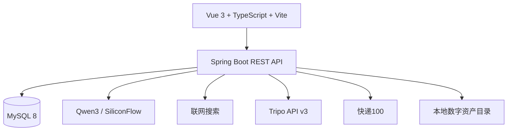

# 之间智造 · 文创产品智能生产管理平台

> 面向文创产品设计、打样、量产、仓储与物流团队的一体化业务系统。平台将 **AI 创意设计、BOM/工艺生成、动态成本核算、统一订单、生产执行和物流履约** 串联为可落地的商业闭环。

---

## 项目简介

“之间智造”不是单一的 AI 生图工具，而是一套围绕文创产品商业化生产构建的管理平台。系统支持从创意资产产生开始，逐步完成材料与工艺规划、成本预算、客户确认、打样、大货生产、仓储出库和物流跟踪。

适用场景包括：

- 文创产品定制与开发
- 景区文创、城市礼物、企业礼赠
- IP 衍生品与设计师产品
- 亚克力、冰箱贴、徽章、贴纸、明信片、帆布袋、包装礼盒等产品
- 设计打样、供应链协作、批量生产和订单履约

## 核心商业闭环


系统使用统一订单号管理同一笔商业业务，不以“打样订单号”和“大货订单号”割裂客户订单。打样、量产、发货等任务在各自业务区域独立展示，并通过订单号保持关联。

---

## 当前功能模块

### 1. 经营看板

经营看板集中展示平台关键经营与执行数据，并面向日常经营处理进行了增强：

- 商业订单金额与订单数量
- 生产中、待发货等业务状态
- 库存预警与物流异常
- 最近生产订单和订单动态
- 四类实时运营仪表盘：履约完成率、订单推进率、风险控制指数、审批响应指数
- 今日经营待办：审批待处理、客户待确认、待下达生产、风险待跟进
- 异常提醒：库存预警、物流异常、审批积压
- 核心功能快捷入口

### 2. 创意设计

#### 2D 创意生图

基于 Tripo 图像生成能力构建的创意出图流程：

```text
填写基础创意描述
→ Qwen3 整理并优化提示词
→ 人工确认或修改 Prompt
→ 选择 Tripo 图像模型与官方模板
→ 异步生成图片
→ 后台自动轮询、下载并保存
→ 页面预览与资产库留存
```

主要能力：

- Qwen3 提示词整理与优化
- Tripo 文本生成图片
- 支持平台提供的模型、模板、T-Pose、Sketch to Render 等参数
- 展示真实任务状态和生成进度
- 生成完成后直接显示，无需刷新页面
- 图片自动下载到本地服务器并写入数字资产库
- 历史资产在页面中持续留存

#### 3D 辅助建模

接入 Tripo API，实现文本、单图和多视图生成 3D 模型：

- 文本生成 3D
- 单张参考图生成 3D
- 多视图生成 3D
- Qwen3 文生 3D 提示词优化
- 展示 Tripo API 可用积分与当前连接模型
- 支持 P 系列和 H 系列模型选择
- 根据模型能力动态开放精度、贴图、面数和拓扑参数
- 后台每 5 秒自动同步任务进度
- 任务成功后自动下载模型文件和预览图
- 模型资产持久化展示，刷新或重新登录后仍可查看、下载

当前支持的模型选项：

| 系列 | 模型 | 适用方向 |
|---|---|---|
| P 系列 | `tripo-p1` | 低面数、轻量化资产 |
| H 系列 | `v3.1-20260211` | 最新高精度生成 |
| H 系列 | `v3.0-20250812` | 稳定版与高级参数 |
| H 系列 | `v2.5-20250123` | 兼容模式 |

可用参数会根据所选模型与生成模式自动约束，包括：贴图、PBR、贴图质量、几何质量、面数、朝向、图片修复、自动尺寸、四边面、智能低模、部件拆分、UV、压缩及随机种子等。

> 浏览器关闭不会取消已经提交的任务。Spring Boot 后台调度器会继续查询 Tripo 状态，并在任务完成后自动保存模型和预览文件。

#### 智能评估

智能评估作为独立功能，可对产品创意、设计图和包装方案进行商业可行性分析：

- 上传产品图、设计图或包装图
- 填写目标人群、价格、材质、销售场景和生产要求
- 多角色智能评审
- 输出综合评分、评审结论和可行性建议
- 分别给出设计、市场、生产等维度的意见
- 评估结果可用于后续方案修改和生产决策

### 3. 生产管理

#### 智能成本核算引擎

从产品方案到可执行订单的核心工作台：

- AI 生成 BOM 物料明细
- AI 生成生产工艺路线
- 支持人工新增、删除和修改物料/工序
- 根据单件用量、采购单价、损耗率和生产数量动态重算成本
- 计算材料、工艺、包装、人工及其他生产费用
- 生成详细报价并创建商业订单
- 保存人工调整后的客户、公司、联系人、地址和特殊要求
- 在订单确认前展示完整报价、BOM、工艺、客户及生产信息
- 确认后进入打样或大货生产流程

当单件用量、单价、损耗率或数量发生变化时，成本参考和总预算会同步更新，而不是使用固定参考值。

#### 产品打样管理

- 按统一订单号查看打样任务
- 展示客户、公司、产品、数量、交期和报价明细
- 查看关联 BOM 与工艺路线
- 管理待确认、已确认、生产中、已完成等状态
- 保留打样阶段的执行记录

#### 大货生产管理

- 按统一订单号管理量产任务
- 展示大货物料明细、工艺路线和生产预算
- 跟踪生产数量、交期与执行状态
- 与打样结果、仓储和物流信息保持关联
- 支持从订单到量产再到出库的完整追踪

### 4. 仓储与物流管理

#### 智能库存预警 / 入库拣货出库

- 库存台账与可用库存管理
- 智能库存不足预警
- 物料和成品入库
- 订单拣货
- 成品出库
- 库存变动记录与订单关联

#### 物流跟踪

- 根据统一订单号绑定物流公司和运单号
- 查询订单对应的发货信息
- 配置快递100后进行真实物流查询与订阅
- 展示运输轨迹、签收状态和物流异常
- 未配置物流服务时不伪造物流数据

### 5. 连锁、财务申请与审批中心

系统已从轻量审批列表升级为可运行的正式审批流，用于覆盖门店、财务、生产、市场、项目、人事、考勤和内部事项审批场景。

#### 员工提交申请

员工可在对应业务页面填写并提交申请：

- **之间连锁**
  - 门店营销方案申请
  - 新商品上架申请
  - 商品售价调整申请
- **财务管理**
  - 固定资产报废申请
  - 对公付款申请
  - 备用金申请、备用金还款、备用金核销
  - 个人费用报销、差旅报销、特殊事项报销
  - 促销活动审批
  - 用章用印申请
  - 开票申请
- **生产与供应链**
  - 产品打样申请
  - 大货生产申请
  - 生产类工单审批联动
- **市场、项目、人事与考勤**
  - 市场部需求申请
  - 项目立项 / 询价申请
  - 人力资源申请
  - 请假、补卡、出差、外出等考勤申请

提交后的申请会进入统一审批中心，保留申请人、申请类型、字段内容、流程节点、审批意见和完整操作时间线。

#### 审批流能力

当前审批统一升级为 **四人会签**：系统会自动创建 `审批员1`、`审批员2`、`审批员3`、`审批员4` 四个固定审批账号，申请必须由四人全部同意后才会进入“已通过”状态。

| 流程类型 | 适用场景 | 说明 |
|---|---|---|
| 四人会签审批 | 普通连锁、市场、项目、人事、考勤、财务、生产事项 | 审批员1-4 缺一不可，全部通过后自动批准 |

审批流支持：

- 固定四人会签
- 防重复审批：同一审批员同一轮只能通过一次
- 审批进度展示：可看到审批员1-4谁已通过、通过时间和意见
- 审批意见
- 审批时间线
- 审批日志留痕
- 当前节点和当前处理人展示
- 申请人撤回
- 驳回后重新提交
- 审批消息提醒数据表

#### 审批中心

超级管理员和审批主管可通过左侧菜单进入：

```text
总览 → 审批中心
```

审批中心支持：

- 查看待审批、已通过、已驳回、已撤回申请
- 按状态、类型、申请人、单号和字段内容筛选
- 查看申请详情、流程条、审批时间线和审批日志
- 查看四名审批员的会签进度
- 填写审批意见
- 审批员1-4批准 / 驳回申请
- 撤回申请
- 驳回后重新提交
- 展示审批人、审批时间、当前节点和最终结果

> 当前审批数据已接入后端数据库表，支持跨设备、跨浏览器和长期留痕；前端负责交互展示，后端负责流程推进、权限校验、状态回写和日志记录。

### 6. 角色权限体系

系统将账号角色统一为三类，旧编码保持兼容：

| 角色编码 | 角色名称 | 权限说明 |
|---|---|---|
| `admin` | 超级管理员 | 拥有全部功能，包括账号权限、业务管理、申请审批和系统配置 |
| `technician` | 审批主管 | 可查看业务模块并处理审批，但不能管理账号权限 |
| `feeder` | 员工 | 可制作内容、提交连锁/财务申请，不能审批和管理账号 |

权限分工：

- **超级管理员**：可访问所有菜单，包括 `账号权限` 和 `审批中心`
- **审批主管**：可访问 `审批中心`、业务管理、仓储、物流、生产和申请相关页面
- **员工**：可访问经营看板、创意制作、连锁申请、财务申请、打样/大货等提交类页面

### 7. 设计师 / 创作者与账号权限

- 设计师、创作者信息管理
- 用户账号与角色权限管理
- 按角色控制菜单与业务能力

### 8. 供应商列表与 AI 查询助手

系统新增供应商银行账户台账，用于集中维护供应商对公账户、开户行、所在地和核验备注。

供应商列表支持：

- 供应商名称、收方编号、户名、银行账号、银行、开户行和所在地查询
- 新增供应商账户，保存后立即进入数据库
- 按银行、地区和异常备注筛选
- 导出当前查询结果 CSV
- 复制账号或付款信息

#### AI 助手供应商查询重构

右下角 AI 助手已从“关键词硬编码匹配”升级为 **Text-to-API** 架构。

新的供应商查询链路：

```text
用户自然语言问题
→ LLM 识别意图并生成 search_suppliers 或 get_supplier_statistics JSON 参数
→ 后端工具执行安全参数化数据库查询
→ LLM 基于真实工具结果生成纯文字短回答
```

明细查询工具为 `search_suppliers`，用于查询具体供应商、数量、地区筛选、银行筛选和账号信息，支持以下结构化参数：

```json
{
  "region": "广州",
  "keyword": "包装",
  "bank_name": "建设银行",
  "is_count_only": true,
  "limit": 20
}
```

聚合统计工具为 `get_supplier_statistics`，用于回答“供应商分为哪些地区”“各地区多少家”“有哪些开户银行”“按什么分类”等去重和分组统计问题：

```json
{
  "group_by_field": "region",
  "include_count": true
}
```

当前聚合维度：

- `region`：按供应商所在地统计
- `bank_name`：按开户银行统计
- `supplier_type`：预留维度。当前数据库没有供应商类型字段，工具会明确返回“暂不支持”，AI 不允许编造分类

设计约束：

- AI 助手强制依赖大模型：用户可见回答必须由大模型基于真实工具结果总结，禁止绕过大模型直接输出纯数据库结果
- 查询链路允许后端做容错补参，但只能用于修正口语化条件；不能代替大模型完成最终表达
- LLM 负责自然语言理解、参数生成和最终业务化总结，不允许直接生成 SQL
- 后端使用 `JdbcTemplate` 占位符参数化查询，避免注入风险
- 供应商明细、数量、账号类问题必须先调用 `search_suppliers` 获取真实数据
- 供应商地区列表、银行列表、各地区数量分布、分类维度问题必须先调用 `get_supplier_statistics`
- 数据唯一来源原则：供应商相关的名称、数量、地区、银行、分类必须且只能来自工具返回 JSON
- 禁止外部知识注入：AI 严禁用“中国地理分区”“行业常识”“训练数据印象”补充供应商分类
- 工具不支持某个维度时，必须明确说“当前数据库暂不支持该维度的查询”，严禁编造
- 生成回答前必须自检：回答里的每个实体、数字、分类都应能在工具结果里找到对应原文
- 数量类问题优先返回数字和名称，不刷完整账号
- 只有用户明确询问账号、账户、付款信息时，才返回完整银行账号
- 涉及账号和付款信息时，固定提醒：付款前请务必人工二次核验户名、账号及开户行信息
- AI 输出适配右下角小窗口，默认使用纯文字短段落，不使用 Markdown 表格或竖线表格

示例：

```text
问：广州的供应商有多少个
答：我按所在地包含广州筛选，广州共有 2 个供应商，分别是：广州恒生包装制品有限公司、厚得（广东）生物科技有限公司。

问：广东做包装的厂子
答：我按所在地包含广东且名称包含包装筛选，共找到 2 个供应商：广州恒生包装制品有限公司、东莞市宸宇包装有限公司。

问：深圳星米三维的账号是多少
答：返回该供应商账号、开户行，并追加付款核验提醒。

问：供应商分为哪几个地区
答：调用 get_supplier_statistics(group_by_field=region)，只列出数据库实际存在的所在地及数量，不输出华北、华东、大湾区等工具结果中不存在的分类。

问：供应商按什么标准分类的
答：当前数据库仅支持按地区和银行维度统计，暂无供应商类型等自定义分类标准。
```

#### 联网搜索与混合分析

AI 助手同时支持联网搜索。当用户明确询问“最新、联网搜索、新闻、政策、趋势、官网”等外部信息时，后端会先执行联网搜索，再把搜索结果交给大模型总结。

供应商风险、优劣、舆情类问题采用“内部事实为基，外部情报增强”的策略：

```text
先查 search_suppliers 内部台账
→ 再按供应商全称联网搜索公开信息
→ 最后生成纯文字的结论、内部事实、外部情报和行动建议
```

未检索到明确公开来源时，AI 必须说明“未检索到明确公开信息”，不得编造注册资本、诉讼、纳税等级、经营异常等结论。

#### AI 助手总规则

- 系统内数据问答不是普通查询工具，必须采用“数据库/工具取真实事实 + 大模型总结表达”的链路。
- 供应商、审批中心、打样工单等业务数据可以由后端工具保证查询准确性，但最终给用户的自然语言答案必须经过大模型组织。
- 当数据库已查到但连接不上大模型时，助手必须实话实说“连接不上大模型”，不绕弯、不假装已经智能总结。
- AI 助手前端统一使用流式输出接口 `/api/ai/chat/stream`，边接收边显示，避免用户长时间等待空白。
- 大模型不能编造数据库没有返回的数量、名称、地区、账号、审批状态、负责人和日期。


#### 2D 生图服务商选择

2D 创意生图支持在页面内选择服务商：

- `Google Imagen 4`：默认排在首位，通过 Replicate `google/imagen-4` 生成，支持 `1K/2K`、`1:1/16:9/9:16/4:3/3:4` 和 `png/jpg`，结果自动保存到系统资产库。
  - 选择 Imagen 4 时，Qwen 提示词优化会按“暖色近景、复古厨房/桌面、包装材质、字体标签、浅景深、环境暗示”的商业摄影模板输出英文 Prompt。
  - 优化完成后同时返回“中文使用说明”，说明适用场景、参数建议、微调方向和版权/打样注意事项。
- `Tripo`：沿用原有 Text-to-Image API，任务完成后自动保存到系统资产库。
- `墨刀 AI 设计`：后端通过 Streamable HTTP MCP 调用墨刀 `generate_image`，使用 `modao-token` 鉴权；当墨刀返回可下载图片链接时自动保存到系统资产库并回传到 2D 页面展示。

Imagen / 墨刀配置项：

```properties
replicate.api.key=${REPLICATE_API_KEY:}
replicate.api.base-url=https://api.replicate.com/v1
replicate.imagen.model=google/imagen-4

modao.api.key=${MODAO_API_KEY:}
modao.design.url=https://modao.cc/ai/design/spmrsxjgcyi6g0h1/6a5dd48151e5a21110c1697a
modao.mcp.url=https://modao.cc/agent-py/ai/mcp
modao.chrome.path=/Applications/Google Chrome.app/Contents/MacOS/Google Chrome
```

注意：Replicate 和墨刀令牌必须放在 `shixun/application-local.properties` 或环境变量中，不能提交到仓库。若 Replicate 返回 `401/403` 需检查 API Key，若返回 `402` 需检查账户余额/计费；若墨刀返回 `INVALID_TOKEN`，需要到墨刀头像 → 令牌设置重新创建 MCP/API 令牌；若返回 `insufficient_points`，说明 MCP 已连通但墨刀账号积分不足。

### 9. 供应链打样工单明细导入

系统已嵌入 `2026打样申请` 工作表数据，入口为左侧菜单：`生产管理 > 打样工单明细`。

导入原则：

- 原工作表共 155 行、34 列，其中第 1 行为表头，系统实际导入 154 条业务明细
- 每一条 Excel 打样明细对应系统表 `supply_chain_sample_work_order` 的一条记录
- 34 个原始字段全部保存在 `raw_json`，同时抽取常用字段用于查询和统计
- 使用 `SourceID`、Excel 原始行号、行校验和三重校验，避免重复和遗漏
- 导入 SQL 为幂等执行：`sample_work_order_import.sql` 使用 `INSERT IGNORE`，重复启动不会重复插入

系统能力：

- 按申请编号、项目名称、产品名称、负责人、产品类型、SourceID 模糊查询
- 按工单状态、负责人、订单类型、产品类型筛选
- 查看原始 34 列，便于和 Excel 逐行核对
- 导出当前查询结果 CSV
- `/api/supply-chain/sample-work-orders/verify` 可返回完整性校验结果，完整时应显示 154/154 条明细、155 行含表头、34 列

生产管理下新增 `打样申请` 小菜单：

- 支持新增、编辑、删除打样单，新增数据写入同一张 `supply_chain_sample_work_order` 表
- 打样单可提交到审批中心，审批分类为 `production`，类型为 `sampleRequest`
- 审批中时工单状态自动变为 `待审批`
- 审批通过后自动回写为 `已通过 / 待打样`
- 审批驳回后自动回写为 `已驳回 / 审批驳回`
- 后续可手动维护工单状态：草稿、待审批、待打样、进行中、已完成、延期完成、项目暂停
- 删除采用逻辑删除，历史数据不会物理丢失
- 右下角 AI 助手支持实时查询打样工单明细，可回答“进行中的打样有几个”“李楷负责哪些打样”“北京天文馆打样进度怎么样”“冷冻食品打样有哪些”等问题
- AI 查询采用 Text-to-API + LLM 总结：先由大模型参与自然语言理解，再由后端查询 `supply_chain_sample_work_order`，最后必须由大模型基于真实结果生成业务化回答；禁止绕过大模型直接输出纯数据，禁止编造项目、产品、负责人、数量和日期

---

## 订单与数据关联设计

平台围绕统一商业订单组织数据：

```text
商业订单 ORD...
├── 详细报价 QUO...
├── 打样任务 SMP...
├── 大货任务 MFG...
├── BOM物料明细
├── 工艺路线
├── 客户/公司信息快照
└── 发货任务 SHP... / 物流轨迹
```

- `ORD...`：面向客户与业务管理的统一订单号
- `QUO...`、`SMP...`、`MFG...`、`SHP...`：报价、打样、量产和发货的内部任务号
- 客户和公司信息以业务快照方式随订单保存，避免后续修改基础资料影响历史订单
- 人工调整后的物料、工艺、报价和客户要求会随订单一并保存

---

## 技术架构



### 后端

| 技术 | 用途 |
|---|---|
| Java 17 | 服务运行环境 |
| Spring Boot 2.7.3 | Web 服务与业务接口 |
| MyBatis / JdbcTemplate | 数据访问 |
| MySQL 8 | 业务数据持久化 |
| JdbcTemplate 参数化查询 | `search_suppliers` 工具执行与安全查询 |
| Spring Scheduling | Tripo 异步任务后台轮询与自动保存 |
| Springdoc OpenAPI | API 文档 |

### 前端

| 技术 | 用途 |
|---|---|
| Vue 3 | 页面与组件框架 |
| TypeScript | 类型约束 |
| Vite | 开发和构建工具 |
| ECharts | 经营数据可视化 |
| xlsx / jsPDF | 数据与文档导出 |

### 外部服务

| 服务 | 用途 | 是否必需 |
|---|---|---|
| Tripo API v3 | 2D 图像、3D 模型生成 | 使用创意生成时需要 |
| Qwen3 / SiliconFlow | 提示词优化、智能评估、BOM/工艺辅助、Text-to-API 参数生成与答案整理 | 使用 AI 分析时需要 |
| 联网搜索 | AI 助手外部信息检索与供应商公开情报辅助分析 | 使用联网问答时需要 |
| 快递100 | 真实物流查询与订阅 | 使用真实物流时需要 |

---

## 项目目录

```text
smart_pig/
├── shixun/                    # Spring Boot 后端
│   ├── src/main/java/         # 控制器、服务和业务代码
│   ├── src/main/resources/    # 配置、数据库脚本、静态资源
│   └── pom.xml
├── shixun-vue/                # Vue 3 前端
│   ├── src/components/        # 业务组件
│   ├── src/api/               # 前端 API 封装
│   └── package.json
├── deploy/
│   └── env.example            # 生产环境变量模板
├── scripts/
│   └── aliyun-start.sh        # 阿里云安装、构建和部署脚本
├── DEPLOY_ALIYUN.md           # 阿里云详细部署手册
└── README.md
```

---

## 本地开发

### 环境要求

- JDK 17
- MySQL 8.x
- Node.js 22+ 与 npm
- Git

### 1. 获取代码

```bash
git clone https://github.com/Timekeeper-vv/AndTaste.git
cd AndTaste
```

### 2. 创建数据库

```sql
CREATE DATABASE shixun
  CHARACTER SET utf8mb4
  COLLATE utf8mb4_unicode_ci;
```

数据库结构位于：

```text
shixun/src/main/resources/and_taste_schema.sql
```

可手动导入：

```bash
mysql -u root -p shixun < shixun/src/main/resources/and_taste_schema.sql
```

### 3. 配置后端本地环境

在 `shixun/` 目录创建 `application-local.properties`：

```properties
server.address=0.0.0.0
server.port=8080

spring.datasource.url=jdbc:mysql://127.0.0.1:3306/shixun?useSSL=false&serverTimezone=Asia/Shanghai&allowPublicKeyRetrieval=true&characterEncoding=UTF-8
spring.datasource.username=你的数据库账号
spring.datasource.password=你的数据库密码
spring.datasource.driver-class-name=com.mysql.cj.jdbc.Driver

qwen.api.key=
siliconflow.api.key=
siliconflow.chat.model=Qwen/Qwen3-32B

tripo.api.key=
tripo.api.base-url=https://openapi.tripo3d.com/v3
tripo.model.version=v3.1-20260211

kuaidi100.customer=
kuaidi100.key=
kuaidi100.callback-url=
kuaidi100.salt=
```

`application-local.properties` 已被 Git 忽略，禁止将真实密钥提交到仓库。

### 4. 启动后端

```bash
cd shixun
chmod +x mvnw
./mvnw spring-boot:run
```

后端地址：`http://localhost:8080/`

API 文档：`http://localhost:8080/swagger-ui/index.html`

### 5. 启动前端

另开一个终端：

```bash
cd shixun-vue
npm install
npm run dev -- --host 0.0.0.0
```

前端地址：`http://localhost:5173/`

### 6. 默认演示账号

系统初始化后可直接使用以下账号登录后台：

| 角色 | 用户名 | 密码 | 说明 |
|---|---|---|---|
| 超级管理员 | `superadmin` | `123456` | 推荐使用；拥有全部功能，包括账号权限、审批中心和所有业务菜单 |
| 审批主管 | `approver01` | `123456` | 可进入审批中心处理申请，不能管理账号权限 |
| 固定审批员 | `审批员1` | `123456` | 四人会签成员之一 |
| 固定审批员 | `审批员2` | `123456` | 四人会签成员之一 |
| 固定审批员 | `审批员3` | `123456` | 四人会签成员之一 |
| 固定审批员 | `审批员4` | `123456` | 四人会签成员之一 |
| 员工 | `employee01` | `123456` | 可发起各类申请和使用业务提交类功能 |
| 员工 | `testuser` | `123456` | 本地测试账号 |

部分旧数据库或演示数据中可能还存在以下兼容账号：

| 角色 | 用户名 | 密码 | 说明 |
|---|---|---|---|
| 超级管理员 | `admin` | `123456` | 旧版平台/商城演示账号，是否可用于当前登录取决于数据库初始化版本 |
| 默认账号 | `zhangsan` / `lisi` / `wangwu` | `123456` | 仅在用户表为空时由后端初始化器创建 |

> 默认账号仅用于初始化与本地演示。部署到公网后必须立即修改默认密码。

---

## AI 与第三方服务配置

### Tripo

```properties
tripo.api.key=你的API密钥
tripo.api.base-url=https://openapi.tripo3d.com/v3
tripo.model.version=v3.1-20260211
```

系统会在后端调用 Tripo，前端不会直接持有 API Key。2D 图片与 3D 模型生成均采用异步任务机制，生成完成后文件会下载至服务器并登记到 `digital_asset` 资产表。

### Qwen3 / SiliconFlow

```properties
qwen.api.key=你的Qwen密钥
siliconflow.api.key=你的SiliconFlow密钥
siliconflow.chat.model=Qwen/Qwen3-32B
```

用于提示词整理、智能评估以及生产环节的 AI 辅助分析。具体启用哪个提供方由后端配置和对应业务实现决定。

### 快递100

```properties
kuaidi100.customer=你的Customer
kuaidi100.key=你的Key
kuaidi100.callback-url=https://你的域名/api/logistics/callback/kuaidi100
kuaidi100.salt=你的Salt
```

未配置时，系统仍可保存订单、物流公司和运单号，但不会生成虚假的实时轨迹。

---

## 构建检查


### 审批流接口摘要

| 接口 | 方法 | 说明 |
|---|---|---|
| `/api/workflows/definitions` | `GET` | 获取内置审批流定义 |
| `/api/workflows/applications` | `GET/POST` | 查询 / 提交申请 |
| `/api/workflows/applications/{id}` | `GET` | 查看申请详情、流程、时间线和日志 |
| `/api/workflows/applications/{id}/approve` | `POST` | 当前节点审批通过 |
| `/api/workflows/applications/{id}/reject` | `POST` | 驳回申请 |
| `/api/workflows/applications/{id}/transfer` | `POST` | 转交给指定处理人；四人会签流程不支持转交 |
| `/api/workflows/applications/{id}/withdraw` | `POST` | 申请人撤回 |
| `/api/workflows/applications/{id}/resubmit` | `POST` | 驳回或撤回后重新提交 |
| `/api/workflows/notifications` | `GET` | 查询审批消息提醒 |

### 后端

```bash
cd shixun
./mvnw -DskipTests package
```

供应商 Text-to-API 工具测试：

```bash
cd shixun
./mvnw -Dtest=SupplierSearchToolServiceTest,SupplierAiPromptTemplatesTest test
```

### 前端

```bash
cd shixun-vue
npm run build
```

生产部署脚本会先构建 Vue，再将前端产物复制到 Spring Boot 静态资源目录，最终形成一个可独立运行的 JAR。

---

## 阿里云 ECS 一键部署

详细说明见：[DEPLOY_ALIYUN.md](./DEPLOY_ALIYUN.md)。

推荐环境：

- Ubuntu 22.04 / 24.04，或 Alibaba Cloud Linux 3
- 2 核 4 GB 起步
- 系统盘 40 GB+
- 安全组开放 `22`、`80`、`443`
- 正式环境建议使用阿里云 RDS MySQL 8.0

### 首次部署

```bash
ssh root@你的服务器公网IP

git clone https://github.com/Timekeeper-vv/AndTaste.git /opt/smart_pig
cd /opt/smart_pig

bash scripts/aliyun-start.sh install-deps
cp deploy/env.example .env
vim .env
bash scripts/aliyun-start.sh production
```

`production` 会自动完成：

1. 加载 `.env`
2. 生成后端安全配置文件
3. 初始化数据库和业务账号
4. 构建 Vue 前端
5. 构建 Spring Boot JAR
6. 安装 `smart-pig.service`
7. 配置故障自动重启和开机自启
8. 配置 Nginx 反向代理

完成后访问：

```text
http://你的服务器公网IP/
```

配置域名与 HTTPS 后访问：

```text
https://你的域名/
```

### 更新线上版本

```bash
cd /opt/smart_pig
git pull origin main
bash scripts/aliyun-start.sh production
```

### 常用运维命令

```bash
# 查看服务状态
systemctl status smart-pig

# 重启服务
systemctl restart smart-pig

# 实时查看 systemd 日志
journalctl -u smart-pig -f

# 查看应用日志
tail -f /opt/smart_pig/logs/smart-pig.log

# 脚本健康检查
cd /opt/smart_pig
bash scripts/aliyun-start.sh status
```

---

## 数据与文件持久化

系统中的业务数据保存在 MySQL，AI 生成文件会下载至服务器本地资产目录并写入数字资产表。

建议生产环境定期备份：

- MySQL 数据库
- `generated/` 生成资产目录
- `uploads/` 用户上传目录
- 生产环境 `.env`（加密保存，不进入 Git）

如果未来使用多台应用服务器，建议将上传文件和生成资产迁移至阿里云 OSS，并为数据库配置自动备份。

---

## 安全建议

- 所有 API Key 只能保存在后端环境变量或本地配置文件中
- 禁止把 `.env`、`application-local.properties` 或真实密钥提交到 Git
- 已在聊天、日志或公开渠道出现过的密钥应立即轮换
- 公网部署后立即修改默认管理员密码
- MySQL `3306` 端口不要直接暴露到公网
- 生产环境通过 Nginx 提供服务，不建议公开 `8080`
- 域名上线后启用 HTTPS
- 阿里云安全组的 SSH 端口建议仅允许可信 IP
- 定期备份数据库和生成资产

---

## 当前状态

当前版本已经形成以下可运行闭环：

```text
AI创意设计
→ 数字资产留存
→ BOM与工艺路线
→ 动态成本核算
→ 详细报价与统一订单
→ 客户确认
→ 产品打样 / 大货生产
→ 入库、拣货、出库
→ 订单物流绑定与跟踪
→ 员工提交连锁 / 财务 / 生产 / 人事 / 考勤等申请
→ 多级审批流（或签 / 会签 / 终审）
→ 转交、撤回、驳回重提和审批日志留痕
→ 审批待办提醒与经营看板联动
```

后续可继续扩展：

- OSS 对象存储与 CDN
- WebSocket 实时 AI 订单分析助手
- 供应商协同与采购管理
- 生产排期与产能管理
- 订单利润分析和经营预测
- 企业级审计日志与更细粒度权限
- 可视化审批流配置器和表单设计器

---

## 商业与许可说明

本项目目前用于文创产品智能生产管理系统的研发与部署。正式商用前，请确认所使用的 AI、物流、字体、图片及第三方服务符合各自平台的授权与计费规则。
